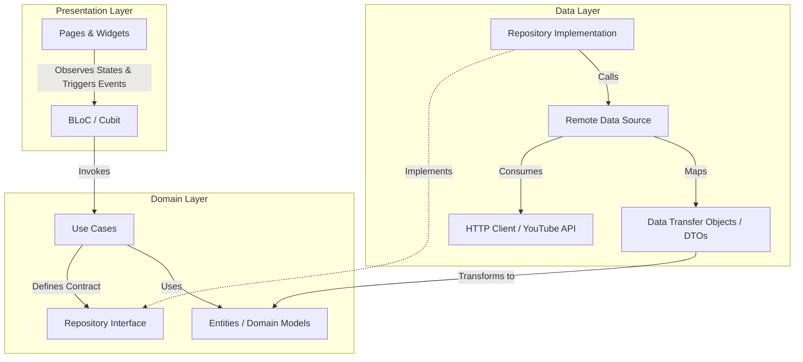

<div align="center">

  

  # 🚢 Alkrouz (الكروز)

  **A modern, responsive Flutter application showcasing curated YouTube video series and channel analytics with Clean Architecture & BLoC.**

  <p align="center">
    <a href="https://flutter.dev"></a>
    <a href="https://dart.dev"></a>
    <a href="https://bloclibrary.dev"></a>
    <a href="https://developers.google.com/youtube/v3"></a>
    <a href="LICENSE"></a>
    
  </p>

</div>

---

## 📖 Table of Contents

- [Overview](#-overview)
- [Key Features](#-key-features)
- [Architecture & Design](#-architecture--design)
- [Directory Structure](#-directory-structure)
- [Tech Stack & Dependencies](#-tech-stack--dependencies)
- [Screenshots & UI Showcase](#-screenshots--ui-showcase)
- [Getting Started](#-getting-started)
  - [Prerequisites](#prerequisites)
  - [Installation](#installation)
  - [API Configuration](#api-configuration)
- [Build & Run](#-build--run)
- [Roadmap](#-roadmap)
- [Contributing](#-contributing)
- [License](#-license)
- [Author & Contact](#-author--contact)

---

## 🌟 Overview

**Alkrouz (الكروز)** is a high-performance, cross-platform mobile application developed using **Flutter** and **Clean Architecture**. The app is crafted to provide a seamless media consumption experience for curated video series (such as Season 1 and Season 2 of *Alkrouz* by *Farg.travels*) powered by the **YouTube Data API v3**.

With native Right-to-Left (RTL) support, fluid animations, custom typography, in-app video streaming, and detailed channel analytics, Alkrouz delivers a rich, engaging user experience while maintaining a clean, modular, and scalable codebase.

---

## ✨ Key Features

- 📺 **Curated Video Catalog**: Organized access to Alkrouz Season 1 and Season 2 video feeds with custom tabbed navigation.
- 🎬 **Seamless In-App Video Playback**: Smooth, interactive video player powered by `pod_player` supporting responsive aspect ratios, playback controls, and progress tracking.
- 📊 **Real-Time Video Analytics**: Live retrieval of video statistics including view counts, like counts, comment counts, and human-friendly formatted release dates.
- 👤 **Channel Profile & Statistics**: Dedicated profile view displaying YouTube channel banner, high-resolution avatar, total subscribers, video count, aggregate view counts, country origin, and join date.
- ⚡ **Clean Architecture**: Strict separation of concerns across **Data**, **Domain**, and **Presentation** layers with Use Cases, Repositories, Entities, and DTOs.
- 🔄 **Robust State Management**: Powered by `flutter_bloc` / `Cubit` for predictable state changes and reactive UI rebuilding.
- 💉 **Dependency Injection**: Service locator setup using `get_it` for testability and loose coupling.
- 🎨 **Polished & Responsive UI**:
  - Full screen adaptability across device sizes via `flutter_screenutil`.
  - Shimmer loading skeleton placeholders (`shimmer`) for a fluid perceived performance.
  - Animated bottom navigation bar (`animated_bottom_navigation_bar`).
  - Stylish pill tabs with `buttons_tabbar`.
  - Rich Arabic typography featuring `Almarai`, `NotoNaskhArabic`, and `Rubik` font families.
  - Beautiful floating notifications using `toastification`.

---

## 🏗️ Architecture & Design

The project is structured according to **Clean Architecture** guidelines, ensuring maintainability, separation of business logic from UI, and easy testability:



### Layer Breakdown:
1. **Data Layer (`features/*/data/`)**:
   - Handles network requests using `http` and interacts with YouTube API v3.
   - Maps JSON responses to Data Transfer Objects (`DTOs`).
   - Implements data sources and repository contracts.
2. **Domain Layer (`features/*/domain/`)**:
   - Contains business logic, Use Cases (`Krouz1VideosResponseUseCase`, `Krouz2VideosResponseUseCase`, `ChannelInformationResponseUseCase`), Domain Entities, and Repository Interfaces.
   - Completely independent of UI and third-party frameworks.
3. **Presentation Layer (`features/*/representation/`)**:
   - Consists of UI screens, custom reusable widgets, and Cubits (`HomeCubit`, `ProfileCubit`) managing UI state.
4. **Core Layer (`core/`)**:
   - Centralized utilities, network configurations, constants, theme colors, routes, dependency injection, and helper formatters.

---

## 📂 Directory Structure

```text
lib/
├── core/
│   ├── utils/
│   │   ├── app_api.dart             # API keys, endpoints, constants
│   │   ├── app_assets.dart          # Asset path constants
│   │   ├── app_colors.dart          # Application color palette
│   │   ├── app_constants.dart       # App names and global constants
│   │   ├── app_localization.dart    # Localization helpers
│   │   ├── app_routes.dart          # Route definitions
│   │   ├── app_toast.dart           # Custom toast notifications
│   │   └── get_it.dart              # Dependency injection setup
│   └── view/
│       └── widgets/
│           ├── app_section.dart     # Main scaffold with animated bottom navigation
│           └── format_numbers.dart  # Arabic & abbreviated number/date formatters
├── features/
│   ├── home/
│   │   ├── data/                    # API services, DTOs, & data source implementations
│   │   ├── domain/                  # Entities, Use Cases, & repository interfaces
│   │   └── representation/          # Home & Details pages, widgets, and HomeCubit
│   └── profile/
│       ├── data/                    # Channel API services & DTOs
│       ├── domain/                  # Channel entities, Use Cases, & repository interfaces
│       └── representation/          # Profile page, widgets, and ProfileCubit
└── main.dart                        # App entry point, DI initialization, ScreenUtil setup
```

---

## 🛠️ Tech Stack & Dependencies

| Category | Package | Version | Purpose |
|:---|:---|:---|:---|
| **Framework** | [Flutter](https://flutter.dev) | `^3.9.2` | Cross-platform UI toolkit |
| **State Management** | [flutter_bloc](https://pub.dev/packages/flutter_bloc) | `^9.1.1` | Predictable state management with Cubit |
| **Dependency Injection** | [get_it](https://pub.dev/packages/get_it) | `^9.2.1` | Fast and lightweight service locator |
| **Networking** | [http](https://pub.dev/packages/http) | `^1.6.0` | REST API communication with YouTube API |
| **Video Player** | [pod_player](https://pub.dev/packages/pod_player) | `^0.2.2` | Customizable YouTube & video player |
| **Image Caching** | [cached_network_image](https://pub.dev/packages/cached_network_image) | `^3.4.1` | Smooth image caching & rendering |
| **UI Responsiveness** | [flutter_screenutil](https://pub.dev/packages/flutter_screenutil) | `^5.9.3` | Responsive layout and font scaling |
| **UI Navigation** | [animated_bottom_navigation_bar](https://pub.dev/packages/animated_bottom_navigation_bar) | `^1.4.0` | Modern animated bottom navigation |
| **Tab Controls** | [buttons_tabbar](https://pub.dev/packages/buttons_tabbar) | `^1.3.15` | Rounded pill-style button tabs |
| **Shimmer Effect** | [shimmer](https://pub.dev/packages/shimmer) | `^3.0.0` | Skeleton loading placeholder animations |
| **Vector Graphics** | [flutter_svg](https://pub.dev/packages/flutter_svg) | `^2.3.0` | High-quality SVG rendering |
| **Notifications** | [toastification](https://pub.dev/packages/toastification) | `^3.0.3` | Elegantly styled in-app toasts & alerts |
| **Internationalization** | [intl](https://pub.dev/packages/intl) | `0.20.2` | Date & number formatting |
| **Splash Screen** | [flutter_native_splash](https://pub.dev/packages/flutter_native_splash) | `^2.4.7` | Native splash screen configuration |

---

## 📸 Screenshots & UI Showcase

<div align="center">
  <table>
    <tr>
      <td align="center" width="33%">
        <b>🏠 Home Feed (Seasons)</b><br/><br/>
        
      </td>
      <td align="center" width="33%">
        <b>▶️ Video Details & Player</b><br/><br/>
        
      </td>
      <td align="center" width="33%">
        <b>👤 Channel Profile & Stats</b><br/><br/>
        
      </td>
    </tr>
  </table>
</div>

---

## 🚀 Getting Started

### Prerequisites

Ensure you have the following installed on your machine:
- [Flutter SDK](https://docs.flutter.dev/get-started/install) (`>= 3.9.2`)
- [Dart SDK](https://dart.dev/get-dart) (`>= 3.9.2`)
- Android Studio / Xcode / VS Code with Flutter & Dart extensions
- An active Android Emulator or Physical Device

### Installation

1. **Clone the repository:**
   ```bash
   git clone https://github.com/Ahmed-Moataz-glitch/Alkrouz.git
   cd Alkrouz
   ```

2. **Install project dependencies:**
   ```bash
   flutter pub get
   ```

3. **(Optional) Generate Splash Screens:**
   ```bash
   dart run flutter_native_splash:create
   ```

### API Configuration

The application requires a YouTube Data API v3 key to query playlist information, video statistics, and channel profiles.

Configure your API credentials in [`lib/core/utils/app_api.dart`](lib/core/utils/app_api.dart):
```dart
abstract class AppApi {
  static const String apiKey = 'YOUR_YOUTUBE_DATA_API_KEY';
  static const String baseUrl = 'www.googleapis.com';
  static const String channelsEndpoint = '/youtube/v3/channels';
  static const String videosEndpoint = '/youtube/v3/videos';
  static const String username = 'Farg.travels';
  // ...
}
```

> 💡 **Tip**: For production, store sensitive keys securely using environment variables or `--dart-define`.

---

## 📱 Build & Run

### Run Locally (Debug Mode)

```bash
flutter run
```

### Build for Android

```bash
# Build APK
flutter build apk --release

# Build App Bundle for Google Play
flutter build appbundle --release
```

### Build for iOS

```bash
flutter build ios --release
```

---

## 🗺️ Roadmap

- [x] Season 1 and Season 2 curated video playlists
- [x] In-app YouTube video streaming via `pod_player`
- [x] Full video metrics (views, likes, comments, upload date)
- [x] Dynamic YouTube channel statistics & banner display
- [x] Shimmer loading states & toast error handling
- [ ] Dark Mode / Light Mode dynamic theme switching
- [ ] Search & filter functionality across series episodes
- [ ] Offline caching & favorites bookmarking with Local Storage (Hive / Isar)
- [ ] Picture-in-Picture (PiP) and background audio playback
- [ ] Multi-language support (Arabic & English localization)

---

## 🤝 Contributing

Contributions make the open-source community an amazing place to learn, inspire, and create. Any contributions you make are **greatly appreciated**.

1. Fork the Project
2. Create your Feature Branch (`git checkout -b feature/AmazingFeature`)
3. Commit your Changes (`git commit -m 'feat: Add some AmazingFeature'`)
4. Push to the Branch (`git push origin feature/AmazingFeature`)
5. Open a Pull Request

---

## 📄 License

Distributed under the **MIT License**. See [`LICENSE`](LICENSE) for more details.

---

## 📬 Author & Contact

**Ahmed Moataz (Ahmed Glitch)**

- **GitHub**: [@Ahmed-Moataz-glitch](https://github.com/Ahmed-Moataz-glitch)
- **LinkedIn**: [Ahmed Moataz](https://linkedin.com/in/ahmed-moataz)
- **Email**: ahmedmoatazglitch@gmail.com

---

<div align="center">
  <sub>Built with ❤️ and Flutter by <b>Ahmed Moataz</b>. Star ⭐ this repository if you enjoyed it!</sub>
</div>
